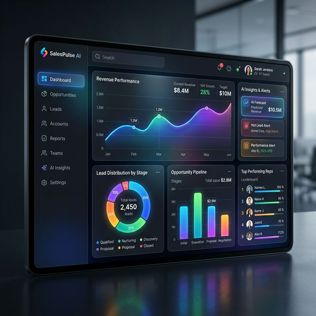
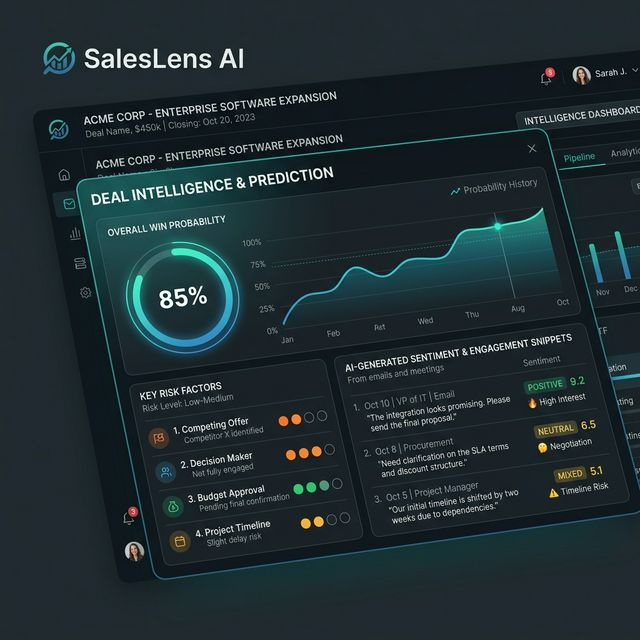
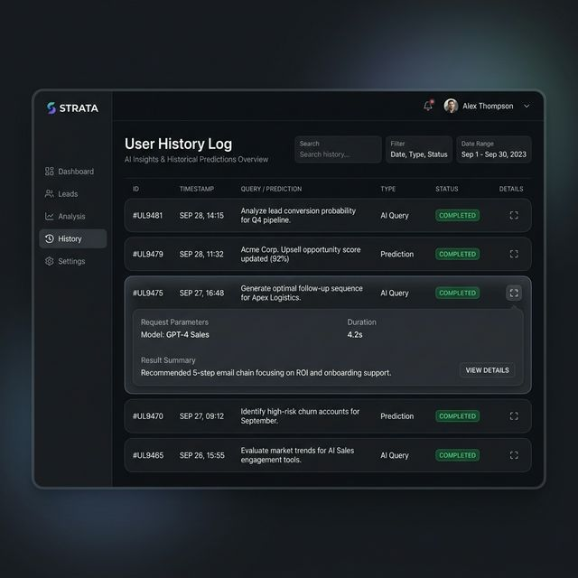

Deployed Project Link **mini-project2-pi.vercel.app**


# SalesLens AI 🎯 — Smart Sales Intelligence Platform


SalesLens AI is a state-of-the-art **AI-powered Sales Intelligence** platform designed for modern sales teams. It empowers revenue leaders, managers, and account executives with predictive insights, sentiment analysis, and deal intelligence to close more deals, faster.

---

## 🚀 Core Features

### 🌟 1. AI Dashboard & Analytics
Get an bird's-eye view of your sales funnel. Real-time KPIs, revenue trends, and pipeline health are displayed using beautiful, interactive glassmorphism-style components.



### 🧠 2. Deep Deal Intelligence
Move beyond guesswork. SalesLens uses sophisticated AI models (Random Forest, XGBoost) to:
- **Predict Deal Outcomes:** Get a high-fidelity win probability for every deal.
- **Risk Assessment:** Automatically flag 'At-Risk' deals based on logic and historical data.
- **Sentiment Scoring:** Analyze the emotional 'vibe' of client communications to measure engagement levels.



### 📧 3. Email Sentiment Analyzer
Paste your client email thread and let our NLP engine (Transformers/RoBERTa) extract the current sentiment, identified emotions, and provide a deep sentiment score to guide your next contact strategy.

### 🕒 4. Activity & Query History
Never lose track of your work. Every prediction, analysis, and query is saved to your personal history for later review. Admins can view cross-team history trends.



### 🏢 5. Organization-Scoped Access
New users can join their company's organization on their first login, ensuring all data is scoped correctly per organization for secure, collaborative work.

---

## 🛠️ Tech Stack

**Frontend:**
- **React.js** (Modern, interactive UI)
- **Tailwind CSS** (Utility-first styling for speed)
- **Lucide React** (Beautiful, consistent iconography)
- **Framer Motion** (Smooth transitions & micro-animations)

**Backend:**
- **Python / FastAPI** (Blazing fast, high-performance API)
- **Pydantic** (Robust data validation)
- **Supabase** (PostgreSQL Database + Auth + RLS)

**Artificial Intelligence:**
- **Scikit-learn / XGBoost** (Structured deal prediction)
- **HuggingFace / PyTorch** (Natural Language Processing for sentiment & emotion analysis)

---

## 🏗️ Project Structure

```bash
├── backend/                  # FastAPI Application
│   ├── services/             # Core business & AI logic
│   ├── schemas/              # Pydantic request/response models
│   ├── utils/                # Data pre-processing & ML utils
│   └── app.py                # Main API entry point
├── frontend/                 # React Frontend
│   ├── src/
│   │   ├── components/       # Shared UI components
│   │   ├── pages/            # Application pages (Dashboard, Intelligence, etc.)
│   │   └── contexts/         # Auth & Global State Management
└── docs/                     # Documentation & Static Assets
```

---

## ⚙️ Installation & Setup

1. **Clone the repository**
   ```bash
   git clone https://github.com/Dipansh631/Mini_project2.git
   cd Mini_project2
   ```

2. **Backend Setup**
   ```bash
   pip install -r requirements.txt
   uvicorn backend.app:app --reload
   ```

3. **Frontend Setup**
   ```bash
   cd frontend
   npm install
   npm run dev
   ```

4. **Environment Variables**
   Set up your `.env` in the root and `frontend/` folders with your Supabase keys.

5. **Database Setup (Task-Based SQL Files)**
   Run the SQL files from `database/sql/` in this order inside Supabase SQL Editor:
   ```bash
   001_extensions.sql
   002_users.sql
   003_deals.sql
   004_emails.sql
   005_user_history.sql
   006_admin_credentials.sql
   007_org_columns_and_backfill.sql
   008_user_scoped_data.sql
   ```
   Full details are in `database/README.md`.

---

Developed with ❤️ for the next generation of sales leaders.
**Author:** [Dipansh631](https://github.com/Dipansh631)
